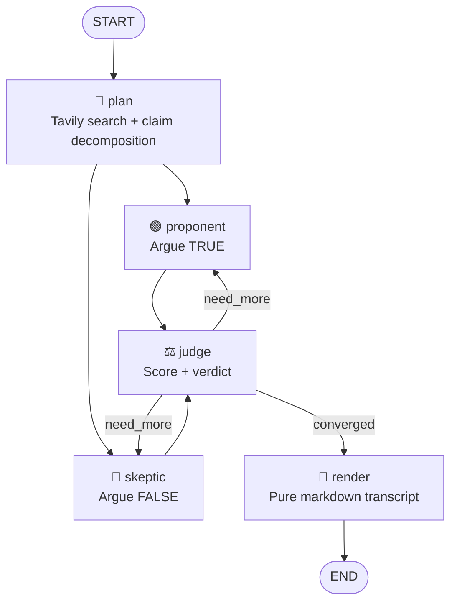
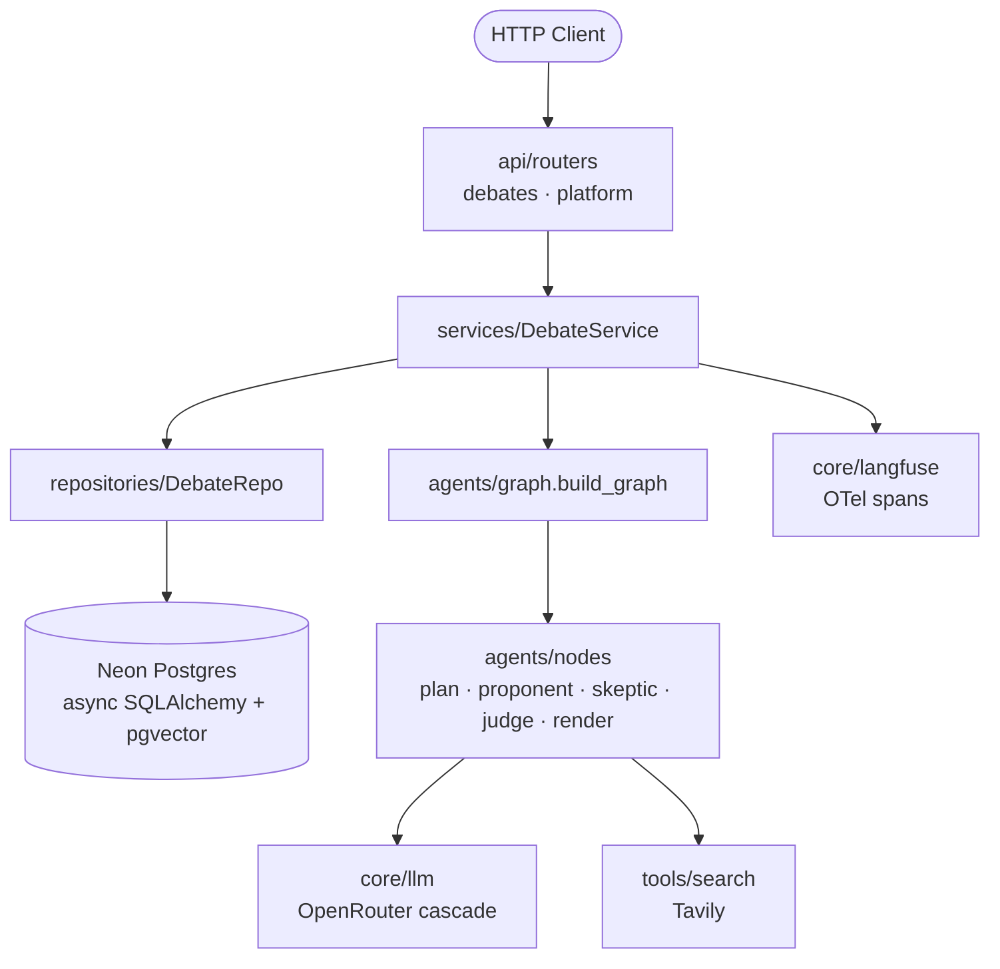
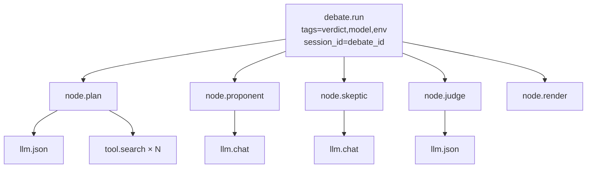

# 📜 `paper-trail-backend`

> 🧑‍⚖️ **Multi-agent fact-checking debater powered by LangGraph.**
> Give it a claim. Two agents debate. A judge scores. You get a receipt.

🌐 [Live API](https://paper-trail-backend-7h27.onrender.com) · 📖 [OpenAPI](https://paper-trail-backend-7h27.onrender.com/docs) · 🎬 [Demo](docs/DEMO.md) · 📐 [Specs](docs/specs/) · 📊 [Eval Report](evals/report.md)


[](https://github.com/Abdul-Muizz1310/paper-trail-backend/actions/workflows/ci.yml)

-brightgreen?style=flat-square)


---

```console
$ curl -X POST $API/debates -d '{"claim":"The Great Wall is visible from low Earth orbit."}'
→ debate_id: 4f2e...   stream: /debates/4f2e.../stream

[plan]       decomposing claim → 3 sub-questions → 15 sources
[proponent]  round 1 · 4 citations · confidence 0.42
[skeptic]    round 1 · 6 citations · confidence 0.71
[judge]      verdict FALSE · confidence 0.91 · converged ✓
[render]     transcript.md ready
```

---

## 🎯 Why this exists

Most "ChatGPT with citations" demos make **one** LLM call, paste footnotes after the fact, and call it done. **paper-trail runs a debate instead.**

- 🟢 A **Proponent** argues the claim is true.
- 🔴 A **Skeptic** argues it is false.
- ⚖️ A **Judge** scores each round on a confidence scale and decides whether the debate has converged.

The loop runs until `confidence ≥ 0.85` OR `round ≥ max_rounds`, then renders a deterministic markdown transcript with inline citations.

**The transcript is the product.** You read *why* the verdict landed where it did — not just a number.

The ship-gate was concrete: **≥ 80% accuracy on a labeled 25-claim eval set**. The [latest run](evals/report.md) scored **21 / 25 = 84%**, avg 1.3 rounds, p95 45.7s.

---

## ✨ Features

- 🔁 Cyclic LangGraph state machine with real back-edges (not a linear chain pretending)
- ⚡ Parallel Proponent ‖ Skeptic execution inside every round
- 🔎 Live Tavily web search grounded per sub-question
- 📝 Deterministic markdown transcript with inline citations
- 🔭 Full OpenTelemetry → LangFuse trace per debate (nodes, tools, generations)
- 🛡️ Graceful observability — tracing never fails a request
- 📡 SSE streaming endpoint for live UI updates
- 📄 Cursor-paginated debate history
- 🔐 Synchronous bearer-authenticated endpoint for bastion integrations
- 🔁 OpenRouter primary → fallback cascade with jittered backoff on 429
- ✅ Red-first TDD — failing test lands before every feature
- 🚀 Render one-click deploy with auto Alembic migrations

---

## 🧠 The debate graph



- **Convergence:** `confidence ≥ 0.85 OR round ≥ max_rounds`
- **State:** `DebateState` TypedDict, `rounds` appended via `operator.add` reducer
- **Purity:** every node body is an `async` pure function of state; all I/O at the edges

---

## 🏗️ Architecture



> **Rule:** `routers → services → repositories → models`. No layer reaches across. Controllers never touch the DB; models never know HTTP.

---

## 🗂️ Project structure

```
src/paper_trail/
├── main.py                  # FastAPI app factory, middleware, CORS
├── api/
│   ├── routers/
│   │   ├── debates.py       # POST/GET /debates, /stream, /transcript.md
│   │   └── platform.py      # Sync bearer-auth endpoint (3-round cap)
│   └── deps.py              # FastAPI dependency injection
├── services/
│   └── debates.py           # DebateService — orchestrates repo + graph
├── repositories/
│   └── debates.py           # DebateRepo — async SQLAlchemy CRUD
├── models/
│   └── debate.py            # Debate ORM model (Neon Postgres)
├── schemas/
│   └── debates.py           # Pydantic v2 HTTP DTOs
├── agents/
│   ├── graph.py             # LangGraph StateGraph assembly
│   ├── state.py             # DebateState TypedDict + reducers
│   ├── nodes/               # plan · proponent · skeptic · judge · render
│   ├── tools/               # Tavily, citations, fetch
│   └── prompts/             # Externalized system prompts (YAML)
└── core/
    ├── config.py            # pydantic-settings from .env
    ├── db.py                # async_sessionmaker + engine
    ├── llm.py               # OpenRouter client w/ retry
    ├── langfuse.py          # OTel trace wrapper (graceful no-op)
    ├── platform.py          # /health, /version, X-Request-ID middleware
    └── errors.py            # ToolError, LLMError
```

---

## 🌐 API surface

| Method | Endpoint | Purpose |
|---|---|---|
| `POST` | `/debates` | Create a debate; spawns graph as background task. Returns `{debate_id, stream_url}`. |
| `GET`  | `/debates` | Cursor-paginated list (`limit` 1–100). |
| `GET`  | `/debates/{id}` | Fetch current state (status, verdict, confidence, rounds). |
| `GET`  | `/debates/{id}/stream` | 📡 **SSE** — emits `state` per round, `done` at terminal, keepalive pings. |
| `GET`  | `/debates/{id}/transcript.md` | Deterministic markdown transcript with citations. |
| `POST` | `/platform/debate` | 🔐 Synchronous bearer-auth endpoint. `max_rounds` capped at 3. |
| `GET`  | `/health` | Liveness probe. |
| `GET`  | `/docs`   | OpenAPI UI. |

---

## 🛠️ Stack

| Concern | Choice |
|---|---|
| **HTTP** | FastAPI + `sse-starlette` + Prometheus instrumentator |
| **Agents** | LangGraph (async cyclic StateGraph, parallel branches) |
| **DB** | Neon Postgres (async SQLAlchemy + asyncpg, pgvector ready) |
| **Migrations** | Alembic, auto-applied via Render `preDeployCommand` |
| **LLM** | OpenRouter — primary `google/gemini-2.0-flash-001`, fallback `google/gemini-2.5-flash-lite`, jittered exp backoff on 429 |
| **Search** | Tavily (5 results per sub-question) |
| **Observability** | LangFuse v3 via OpenTelemetry spans — degrades to no-op on any error |
| **Cache / Queue** | Upstash Redis (configured, reserved) |
| **Tests** | pytest-asyncio + Polyfactory + respx + in-memory SQLite |
| **Lint / Types** | ruff (strict) · mypy (strict) |

---

## 🔭 Observability

Every debate emits a full OpenTelemetry-backed trace to LangFuse:



Per-query tool failures are surfaced in `node.plan` span metadata (`failed_query_count`, `failed_queries`) instead of being silently swallowed. 🛡️ **Tracing never fails a request** — the wrapper returns a graceful no-op on any LangFuse-side error, init failure, or missing config.

---

## 🚀 Run locally

```bash
# 1. clone & env
git clone https://github.com/Abdul-Muizz1310/paper-trail-backend.git
cd paper-trail-backend
cp .env.example .env
# edit: DATABASE_URL, OPENROUTER_API_KEY, TAVILY_API_KEY,
#       LANGFUSE_*, UPSTASH_REDIS_REST_*, CORS_ORIGINS

# 2. install + migrate
uv sync --all-extras
uv run alembic upgrade head

# 3. serve
uv run uvicorn paper_trail.main:app --reload
# → http://localhost:8000/docs
```

### 🔐 Synchronous path (bastion / CLI)

```bash
curl -X POST http://localhost:8000/platform/debate \
  -H 'Authorization: Bearer demo' \
  -H 'Content-Type: application/json' \
  -d '{"claim":"Humans only use 10 percent of their brains.","max_rounds":2}'
```

> Expected: `{"verdict":"FALSE","confidence":0.95,...}` in ~30–60s.

### 📡 Async / streaming path (web UI flow)

```bash
# create
curl -X POST http://localhost:8000/debates \
  -H 'Content-Type: application/json' \
  -d '{"claim":"The Great Wall is visible from low Earth orbit.","max_rounds":3}'
# → {"debate_id":"...","stream_url":"/debates/<id>/stream"}

# subscribe to the SSE stream
curl -N http://localhost:8000/debates/<id>/stream
```

---

## 🧪 Testing

```bash
uv run pytest                                     # full suite
uv run pytest -m "not slow and not integration"   # fast-only (CI)
uv run pytest --cov=src/paper_trail --cov-report=term-missing
```

| Metric | Value |
|---|---|
| **Test count** | 192 tests |
| **Line coverage** | **100%** |
| **Methodology** | Red-first TDD — failing test lands in git before implementation |
| **External I/O** | Fully mocked — `respx` (HTTP), in-memory SQLite, dependency-overridden fakes. No real LLM / Tavily / LangFuse calls in CI. |

---

## 📊 Eval gate

```bash
uv run python -m evals.run_eval --dry-run       # 25 claims, stub verdicts (CI-safe)
uv run python -m evals.run_eval --delay 10      # 25 claims, real LLM → evals/report.md
uv run python -m evals.run_eval --max-claims 5  # smoke run
```

Real mode **exits non-zero if accuracy < 80%**. Current: **84% (21/25)**. See [`evals/report.md`](evals/report.md).

---

## 📐 Engineering philosophy

| Principle | How it shows up |
|---|---|
| 🧪 **Spec-TDD** | Every feature ships with a red test first. See `test: red tests for <feature>` pattern in `git log`. |
| 🛡️ **Negative-space programming** | `Literal` types gate sides / verdicts; Pydantic v2 rejects invalid shapes at the HTTP boundary; convergence logic expressed as `is_converged(state)`. |
| 🏗️ **MVC layering** | `routers → services → repositories → models`. No cross-layer reaches. |
| 🔤 **Typed everything** | `mypy --strict` clean. Pydantic v2 DTOs, TypedDict graph state, typed SQLAlchemy models. |
| 🌊 **Pure core, imperative shell** | Node bodies are pure functions; LLM/Tavily/DB/LangFuse at edges, wrapped in `span()` context managers. |
| 🎯 **One responsibility per module** | Every file name describes exactly one thing — never "and". |

---

## 🚀 Deploy

Render free tier via [`render.yaml`](render.yaml). One-time setup:

1. Render dashboard → **New → Blueprint** → connect this repo
2. Fill every `sync: false` env var in service settings
3. Copy the Deploy Hook URL → `gh secret set RENDER_DEPLOY_HOOK --body '<url>'`
4. Push to `main` → CI lint/test/build → CI fires the hook → Render rebuilds → `preDeployCommand: alembic upgrade head` → new container goes live

---

## 📄 License

MIT. See [LICENSE](LICENSE).

---

> 🧾 **`paper-trail --help`** · built with receipts, not vibes
