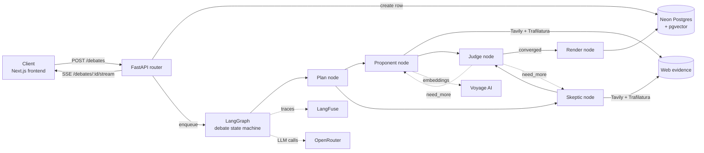
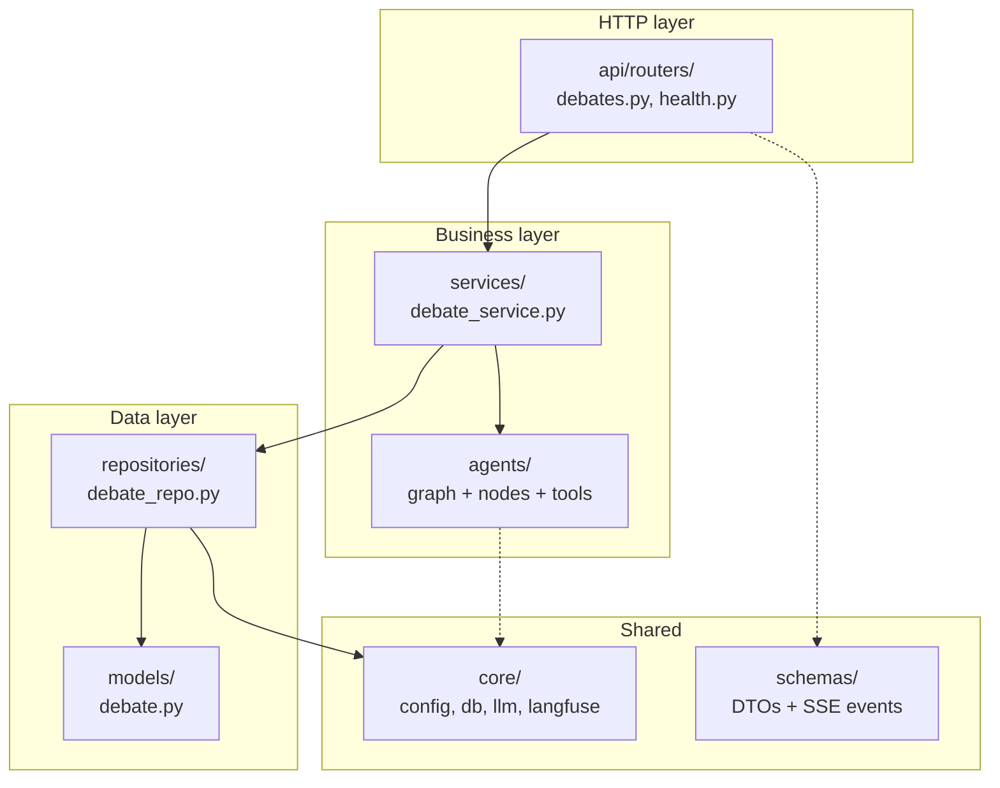
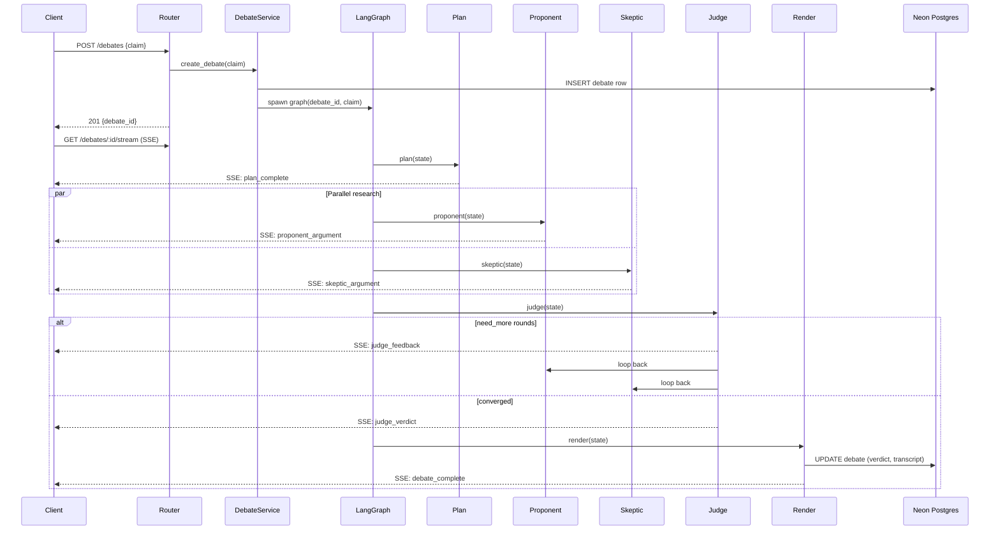
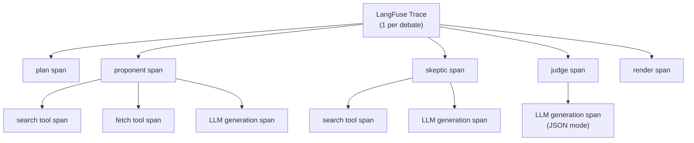

# paper-trail architecture

## System overview

## Component map

| Layer | Key files | Responsibility | Never touches |
|---|---|---|---|
| `main.py` | App factory, lifespan, middleware registration | -- | Business logic |
| `api/routers/` | `debates.py`, `health.py` | HTTP shape, request validation, SSE streaming | DB, LLMs |
| `services/` | `debate_service.py` | Orchestration -- create debate, launch graph, stream events | HTTP, raw SQL |
| `repositories/` | `debate_repo.py` | Async SQLAlchemy queries on Debate rows + embeddings | HTTP, LLMs |
| `models/` | `debate.py` | SQLAlchemy declarative models (Debate, Round, Evidence) | Anything non-DB |
| `schemas/` | `debate.py`, `events.py` | Pydantic DTOs at the HTTP + SSE boundary | DB |
| `agents/graph.py` | `build_graph()` | LangGraph `StateGraph` assembly, edge definitions, compile | HTTP |
| `agents/state.py` | `DebateState` | TypedDict state schema shared by all nodes | HTTP |
| `agents/nodes/` | `plan.py`, `proponent.py`, `skeptic.py`, `judge.py`, `render.py`, `_format.py` | Individual graph nodes -- each is a pure function `(state) -> state` | HTTP, DB writes |
| `agents/tools/` | `search.py`, `fetch.py`, `cite.py` | LangChain tools bound to proponent/skeptic nodes | DB, HTTP |
| `agents/prompts/` | Per-node prompt templates | System/user prompts with Jinja-style variable slots | Everything |
| `core/config.py` | `Settings` | pydantic-settings env loading, secret resolution | Everything above |
| `core/db.py` | Engine, session factory | Async SQLAlchemy engine + `get_session` dependency | Everything above |
| `core/llm.py` | `get_chat_model()` | OpenRouter LLM client with primary/fallback cascade | Everything above |
| `core/langfuse.py` | `get_tracer()` | LangFuse tracing wrapper, fail-safe decorator | Everything above |
| `core/platform_auth.py` | Middleware | Render platform auth, CORS, request-id propagation | Everything above |
| `platform/` | Health, readiness | Platform-level probes for Render | Everything above |

## MVC layering

## Debate lifecycle

## Concurrency model

- **Parallel debate agents**: Proponent and Skeptic run as parallel LangGraph edges from `plan`; both feed `judge` via a fan-in barrier. This halves wall-clock time per round.
- **LLM cascade**: `core/llm.py` tries `OPENROUTER_MODEL_PRIMARY`, falls back to `_FALLBACK` on 429/5xx. JSON mode enforced for the Judge node to guarantee parseable verdicts.
- **SSE streaming**: The router opens an `EventSource`-compatible stream. Each graph node emits typed events (`plan_complete`, `proponent_argument`, `skeptic_argument`, `judge_verdict`, `debate_complete`) that the service relays as SSE frames.
- **Evidence caching**: Tavily search responses cached in Upstash keyed by `hash(query)` with 24h TTL -- repeat debates on similar claims avoid redundant web fetches.
- **Fail-safe tracing**: LangFuse wraps every node; failures in tracing are caught and logged, never failing the request.

## Observability hierarchy

Each trace captures: model used, token counts, latency, tool inputs/outputs, and the full state diff produced by every node. Traces are queryable in the LangFuse dashboard for debugging slow rounds or hallucinated evidence.
