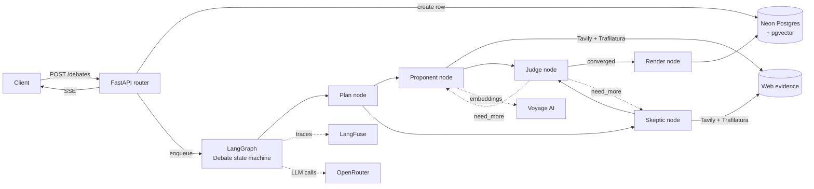

# paper-trail architecture

## Layers

| Layer | Responsibility | Never touches |
|---|---|---|
| `api/routers/` | HTTP shape, request validation, SSE | DB, LLMs |
| `services/` | Orchestration (create debate, run graph, stream) | HTTP, raw SQL |
| `repositories/` | Async SQLAlchemy queries on Debate rows + embeddings | HTTP, LLMs |
| `models/` | SQLAlchemy declarative models | Anything non-DB |
| `schemas/` | Pydantic DTOs at the HTTP boundary | DB |
| `agents/` | LangGraph nodes, state, tools, prompts, graph assembly | HTTP |
| `core/` | Config, DB engine, LLM router, LangFuse wrapper, platform middleware | Everything above |

## Concurrency

- Proponent and Skeptic run as parallel LangGraph edges from `plan` — both feed `judge` via a fan-in.
- LLM calls go through `core/llm.py` which tries `OPENROUTER_MODEL_PRIMARY`, falls back to `_FALLBACK` on 429 / 5xx, enforces JSON mode for the Judge node.
- Tavily responses cached in Upstash keyed by `hash(query)` with 24h TTL.
- LangFuse tracing wraps every node; failures in tracing never fail the request (wrapped in try/except).
