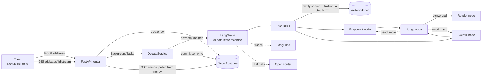
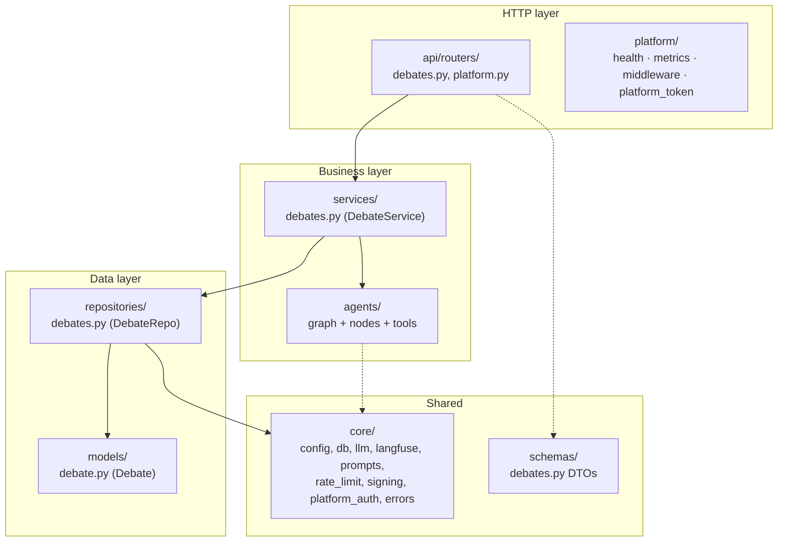
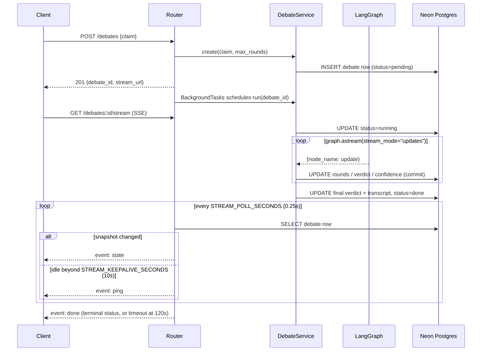
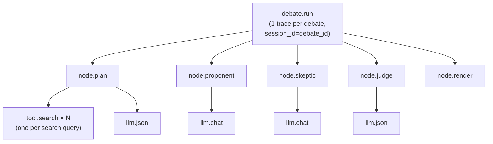

# paper-trail architecture

## System overview

```mermaid
flowchart LR
    Client[Client<br/>Next.js frontend] -->|POST /debates| API[FastAPI router]
    API -->|create row| DB[(Neon Postgres)]
    API -->|BackgroundTasks| Svc[DebateService]
    Svc -->|astream updates| Graph[LangGraph<br/>debate state machine]
    Svc -->|commit per write| DB

    Graph --> Plan[Plan node]
    Plan -->|Tavily search + Trafilatura fetch| Web[(Web evidence)]
    Plan --> Prop[Proponent node]
    Plan --> Skep[Skeptic node]
    Prop --> Judge[Judge node]
    Skep --> Judge
    Judge -->|converged| Render[Render node]
    Judge -.->|need_more| Prop
    Judge -.->|need_more| Skep

    Client -->|GET /debates/:id/stream| API
    API -->|SSE frames, polled from the row| DB

    Graph -.->|traces| LF[LangFuse]
    Graph -.->|LLM calls| OR[OpenRouter]
```

Two things this diagram is deliberately precise about, because earlier revisions
of this file were not:

- **Only the plan node performs web I/O.** It runs Tavily search and Trafilatura
  fetch concurrently and puts the results in `state["plan"]["evidence"]`.
  Proponent and skeptic read that list out of state and make no network calls of
  their own beyond their LLM generation.
- **Nodes never write to the database.** `DebateService` consumes
  `graph.astream(..., stream_mode="updates")` and persists after each node, so
  every write goes through the service → repository path.

## Component map

| Layer | Key files | Responsibility | Never touches |
|---|---|---|---|
| `main.py` | App construction: `configure_logging()`, `install_middleware`, `install_health_routes`, `install_metrics`, `install_platform_token`, router mounting | -- | Business logic |
| `api/routers/` | `debates.py`, `platform.py` | HTTP shape, request validation, SSE streaming | DB, LLMs |
| `api/deps.py` | `get_service()` | FastAPI dependency wiring | DB, LLMs |
| `services/` | `debates.py` (`DebateService`) | Orchestration -- create debate, drive the graph, persist each update | HTTP, raw SQL |
| `repositories/` | `debates.py` (`DebateRepo`) | Async SQLAlchemy queries + opaque cursor pagination over `debates` | HTTP, LLMs |
| `models/` | `debate.py` | SQLAlchemy declarative model `Debate` (+ `DebateStatus`, `DebateVerdict` enums) | Anything non-DB |
| `schemas/` | `debates.py` | Pydantic v2 DTOs at the HTTP boundary | DB |
| `agents/graph.py` | `build_graph()` | LangGraph `StateGraph` assembly + `Send` fan-out, compiled once (`lru_cache`) | HTTP |
| `agents/state.py` | `DebateState`, `RoundEntry`, `initial_state`, `is_converged`, `validate_state` | TypedDict state schema + reducers shared by all nodes | HTTP |
| `agents/nodes/` | `plan.py`, `proponent.py`, `skeptic.py`, `judge.py`, `render.py`, `_citations.py`, `_format.py` | Individual graph nodes -- `async (state) -> state-update`; `_*.py` are pure formatting/citation helpers | HTTP, DB writes |
| `agents/tools/` | `search.py` (Tavily), `fetch.py` (Trafilatura), `cite.py`, `transcript.py` | Plain async functions called by the **plan** node; `transcript.py` canonicalizes + hashes a transcript | DB, HTTP handlers |
| `agents/prompts/` | `plan.md`, `proponent.md`, `skeptic.md`, `judge.md`, `render.md` | Markdown system prompts loaded by `core/prompts.load()` | Everything |
| `core/config.py` | `Settings` | pydantic-settings env loading | Everything above |
| `core/db.py` | `make_engine()`, `session_scope()` | Async SQLAlchemy engine + short-lived session scope | Everything above |
| `core/llm.py` | `chat()`, `chat_json()` | OpenRouter client, primary→fast→fallback cascade, jittered backoff on 429 | Everything above |
| `core/langfuse.py` | `span()`, `trace()`, `update_current_*` | LangFuse/OTel tracing wrapper; degrades to a no-op on any error | Everything above |
| `core/prompts.py` | `load()` | Reads `agents/prompts/*.md` | Everything above |
| `core/rate_limit.py` | `client_identifier()`, `enforce_rate_limit()`, `rate_limiter()` | Upstash fixed-window per-caller throttle (fail-open) | Everything above |
| `core/signing.py` | `sign_transcript()`, `public_key_pem()`, `verify_transcript_signature()` | Ed25519 receipt signatures | Everything above |
| `core/platform_auth.py` | `verify_platform_token()` | Bearer-token check for `/platform/debate` (fails closed outside demo mode) | Everything above |
| `core/errors.py` | `LLMError`, `ToolError`, `InvalidCursorError` | Typed failure vocabulary | Everything |
| `platform/health.py` | `install_health_routes()` | `GET /health` (with a real `SELECT 1` probe) and `GET /version` | Business logic |
| `platform/logging.py` | `configure_logging()` | structlog JSON logging with `service` / `request_id` fields | Business logic |
| `platform/metrics.py` | `install_metrics()` | Prometheus `GET /metrics`, gated by `METRICS_TOKEN` when set | Business logic |
| `platform/middleware.py` | `install_middleware()` | CORS allowlist + `X-Request-Id` propagation | Business logic |
| `platform/platform_token.py` | `install_platform_token()`, `verify_platform_jwt()` | `X-Platform-Token` EdDSA JWT gate for bastion, with an exempt path list | Business logic |

## Data model

One table. `alembic/versions/0001_initial_debate_table.py` creates `debates`;
`0002_evidence_pool.py` adds three nullable columns. There is **no** `rounds`
table and **no** `evidence` table — a debate's rounds, structured rounds and
caller-supplied evidence pool are JSON columns on the same row:

| Column | Type | Notes |
|---|---|---|
| `id` | UUID | primary key |
| `claim` | Text | ≤2000 chars, enforced at the HTTP boundary |
| `max_rounds` | Integer | 1..10 |
| `status` | Enum (non-native) | `pending` / `running` / `done` / `error` |
| `verdict` | Enum (non-native), nullable | `TRUE` / `FALSE` / `INCONCLUSIVE` |
| `confidence` | Float, nullable | |
| `rounds` | JSON | append-only list of raw round entries |
| `transcript_md` | Text, nullable | rendered markdown |
| `evidence_pool` | JSON, nullable | caller-supplied evidence (spec 08) |
| `rounds_struct` | JSON, nullable | typed rounds + citations for `transcript.json` |
| `transcript_hash` | Text, nullable | SHA-256 over the canonical transcript |
| `created_at` / `updated_at` | TIMESTAMPTZ | |

`0001` also runs `CREATE EXTENSION IF NOT EXISTS vector` on Postgres, but no
column uses a vector type yet and nothing in `src/` computes embeddings. The
extension is groundwork for the cross-debate memory idea in `WHY.md`, not a
shipped feature.

## MVC layering

```mermaid
flowchart TD
    subgraph HTTP ["HTTP layer"]
        Routers["api/routers/<br/>debates.py, platform.py"]
        Plat["platform/<br/>health · metrics · middleware · platform_token"]
    end

    subgraph Business ["Business layer"]
        Services["services/<br/>debates.py (DebateService)"]
        Agents["agents/<br/>graph + nodes + tools"]
    end

    subgraph Data ["Data layer"]
        Repos["repositories/<br/>debates.py (DebateRepo)"]
        Models["models/<br/>debate.py (Debate)"]
    end

    subgraph Shared ["Shared"]
        Schemas["schemas/<br/>debates.py DTOs"]
        Core["core/<br/>config, db, llm, langfuse, prompts,<br/>rate_limit, signing, platform_auth, errors"]
    end

    Routers --> Services
    Routers -.-> Schemas
    Services --> Repos
    Services --> Agents
    Agents -.-> Core
    Repos --> Models
    Repos --> Core
```

## Debate lifecycle

`POST /debates` returns immediately; the graph runs in a FastAPI
`BackgroundTasks` job. The SSE endpoint is an **independent reader**: it polls
the debate row and diffs a snapshot, which is why commit-per-write in the
service matters — without it the stream would have nothing to observe until the
run finished.

```mermaid
sequenceDiagram
    participant C as Client
    participant R as Router
    participant S as DebateService
    participant G as LangGraph
    participant DB as Neon Postgres

    C->>R: POST /debates {claim}
    R->>S: create(claim, max_rounds)
    S->>DB: INSERT debate row (status=pending)
    R-->>C: 201 {debate_id, stream_url}
    R->>S: BackgroundTasks schedules run(debate_id)

    C->>R: GET /debates/:id/stream (SSE)

    S->>DB: UPDATE status=running
    loop graph.astream(stream_mode="updates")
        G-->>S: {node_name: update}
        S->>DB: UPDATE rounds / verdict / confidence (commit)
    end
    S->>DB: UPDATE final verdict + transcript, status=done

    loop every STREAM_POLL_SECONDS (0.25s)
        R->>DB: SELECT debate row
        alt snapshot changed
            R-->>C: event: state
        else idle beyond STREAM_KEEPALIVE_SECONDS (10s)
            R-->>C: event: ping
        end
    end
    R-->>C: event: done (terminal status, or timeout at 120s)
```

### SSE event types

The stream emits exactly four event names, all produced by the router's polling
loop in `api/routers/debates.py`. Graph nodes emit **no** events of their own.

| Event | When | Payload |
|---|---|---|
| `state` | the row's `(status, verdict, confidence, rounds_count, latest-round length)` snapshot changed | `{type, status, verdict, confidence, rounds_count, rounds}` |
| `ping` | no change for `STREAM_KEEPALIVE_SECONDS` — keeps proxies from dropping an idle stream | `{t}` |
| `done` | status reached `done` / `failed` / `error` | `{type, status, verdict, confidence, rounds_count, rounds}` |
| `error` | the debate id does not exist | `{reason: "not_found"}` |

If the 120s `STREAM_MAX_SECONDS` budget expires first, the loop closes with
`done` carrying `{"reason": "timeout"}`.

## Concurrency model

- **Parallel debate agents**: `plan` fans out to proponent and skeptic with two
  `Send`s; both edge into `judge`, which acts as a fan-in barrier. This halves
  wall-clock time per round.
- **Concurrent evidence gathering**: inside `plan`, all Tavily queries run under
  one `asyncio.gather` (`return_exceptions=True`, so one dead query degrades
  instead of failing the node), and the top-N article fetches are likewise
  gathered.
- **Commit per write, not per run**: `DebateService` opens a short-lived session
  for every write. No pooled connection is pinned for the whole run, and the SSE
  reader (a separate session) sees progress as it lands.
- **Bounded runs**: the whole `astream` loop sits inside
  `asyncio.timeout(settings.debate_deadline_s)` so an upstream 429 storm cannot
  pin a background worker indefinitely.
- **LLM cascade**: `core/llm.py` tries `OPENROUTER_MODEL_PRIMARY` and falls back
  on 429/5xx with jittered backoff. JSON mode is enforced for the plan and judge
  nodes to guarantee parseable output.
- **Fail-safe tracing**: LangFuse wraps every node; tracing failures are caught
  and logged, never failing the request.
- **Not implemented**: there is no evidence/search cache. Every debate re-queries
  Tavily even for a claim it has seen before. Upstash *is* provisioned, but
  `core/rate_limit.py` is its only consumer — see the "cache Tavily results"
  item in `WHY.md`.

## Observability hierarchy

```mermaid
flowchart TD
    Trace["debate.run<br/>(1 trace per debate,<br/>session_id=debate_id)"] --> PlanSpan["node.plan"]
    Trace --> ProSpan["node.proponent"]
    Trace --> SkepSpan["node.skeptic"]
    Trace --> JudgeSpan["node.judge"]
    Trace --> RenderSpan["node.render"]

    PlanSpan --> ToolSpan1["tool.search × N<br/>(one per search query)"]
    PlanSpan --> LLMSpan0["llm.json"]

    ProSpan --> LLMSpan1["llm.chat"]
    SkepSpan --> LLMSpan2["llm.chat"]
    JudgeSpan --> LLMSpan3["llm.json"]
```

Span names are exactly those emitted by `core/langfuse.span()` calls in the node
and tool modules. `tool.search` hangs off `node.plan` because plan is the only
node that searches; `agents/tools/fetch.py` is instrumented through its caller's
span rather than its own, and `render` makes no LLM call at all.

Each trace captures: model used, token counts, latency, tool inputs/outputs, and
the state diff produced by every node. Per-query search failures surface as
`failed_query_count` / `failed_queries` on the `node.plan` span instead of being
swallowed. Traces are queryable in the LangFuse dashboard for debugging slow
rounds or hallucinated evidence.
